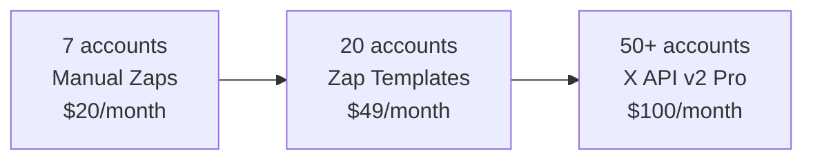

# ⚡ ZAPIER SCALABILITY ANALYSIS
## Individual Zaps vs Bulk Monitoring Options

### 🚫 **BAD NEWS: No Bulk Approach Available**

**Q: Can I monitor multiple accounts with 1 zap?**  
**A: NO** - Twitter deprecated all bulk monitoring methods:

- ❌ **Twitter Lists**: API removed by Twitter
- ❌ **RSS Feeds**: Killed by Twitter in 2013
- ❌ **Multi-trigger Zaps**: Not supported by Zapier (1 trigger per zap)
- ❌ **Hashtag Monitoring**: Available but much less precise

### 📊 **ZAPIER PLAN LIMITS & CAPACITY**

| Plan | Max Zaps | Available for Accounts* | Cost | Viable for You |
|------|----------|------------------------|------|----------------|
| **Free** | 5 | 0 (already using 5) | $0 | ❌ No capacity |
| **Starter** | 20 | 15 accounts | $19.99/month | ✅ **Recommended** |
| **Professional** | 100 | 95 accounts | $49/month | ✅ For scaling |
| **Team** | Unlimited | 500+ accounts | $399/month | ✅ Enterprise |

*Assumes 5 zaps reserved for other uses

### 🎯 **MAXIMUM ACCOUNTS BY PLAN**

```bash
# CURRENT SITUATION
Current usage: 5 zaps
UserOwned.ai need: +7 zaps  
Total needed: 12 zaps

# PLAN REQUIREMENTS
Starter Plan: Can handle up to 15 accounts ($19.99/month)
Professional: Can handle up to 95 accounts ($49/month)
Team: Can handle 500+ accounts ($399/month)
```

### 🤖 **AUTOMATION OPTIONS (Still Individual Zaps)**

#### **Option 1: Manual Setup (Recommended for 7 accounts)**
```bash
Time: 15 minutes total
Method: Manual creation via Zapier interface
Cost: $0 (if on Starter+) or $19.99/month
Scalability: Up to 15 accounts
```

#### **Option 2: Zapier Templates (For Scaling)**
```bash
Method: Create master template → duplicate → modify account
Time: 5 minutes setup + 1 minute per account
Benefit: Faster than manual, but still individual zaps
Best for: 20+ accounts
```

#### **Option 3: Zapier REST API (Development Required)**
```bash
Method: Programmatic zap creation via API
Complexity: Medium development effort
Benefit: Bulk zap management
Still creates: Individual zaps (just automated)
```

### 🚫 **CANNOT CREATE ZAPS FOR YOU**

**Technical Limitation**: I cannot access your Zapier account to create zaps.

**You need to**:
1. Log into your Zapier account
2. Create each zap manually using provided templates
3. Test webhook endpoints

### 📈 **SCALING RECOMMENDATIONS**

#### **IMMEDIATE (7 accounts)**
- **Method**: Manual zap creation
- **Plan needed**: Zapier Starter ($19.99/month)
- **Time**: 15 minutes total
- **Capacity**: Up to 15 total accounts

#### **GROWTH (20-30 accounts)**  
- **Method**: Zapier Professional + templates
- **Plan needed**: Professional ($49/month)
- **Capacity**: Up to 95 accounts

#### **SCALE (50+ accounts)**
- **Method**: **X API v2 Pro** ($100/month)
- **Reason**: Zapier becomes inefficient and expensive
- **Capacity**: Unlimited programmatic control

### 💰 **COST COMPARISON AT SCALE**

| Accounts | Zapier Cost | X API v2 Pro | Winner |
|----------|-------------|--------------|--------|
| **7** | $0* | $100/month | Zapier |
| **15** | $19.99/month | $100/month | Zapier |
| **30** | $49/month | $100/month | Zapier |
| **50** | $49/month | $100/month | Zapier |
| **95** | $49/month | $100/month | Zapier |
| **100+** | $399/month | $100/month | **X API** |

*If already on paid plan

### ⚡ **IMMEDIATE ACTION PLAN**

```bash
# TODAY (15 minutes)
1. Check your current Zapier plan
2. Upgrade to Starter if needed ($19.99/month)
3. Create 7 zaps manually using provided templates:
   - @bittensor_ (CRITICAL)
   - @AethirCloud (HIGH)
   - @KaitoAI (HIGH) 
   - @rendernetwork (HIGH)
   - @virtuals_io (HIGH)
   - @base (MEDIUM)
   - @NEARProtocol (CRITICAL)
4. Test webhook: http://localhost:3000/webhook/x-api
```

### 🔄 **MIGRATION PATH**



### ✅ **FINAL ANSWERS**

**Q: More scalable than 1 zap per account?**
❌ **NO** - Twitter removed all bulk monitoring APIs

**Q: Can you create zaps for me?**
❌ **NO** - Requires manual access to your Zapier account

**Q: Maximum accounts with Zapier?**
✅ **95 accounts** on Professional plan ($49/month)
✅ **500+ accounts** on Team plan ($399/month)

**Q: Best approach for 7 accounts?**
✅ **Manual zap creation** - 15 minutes, $19.99/month

**Q: When to switch to X API?**
✅ **At 100+ accounts** or when you need custom features beyond basic monitoring

---

**🎯 Status: Manual zap creation is the only viable approach for immediate UserOwned.ai integration**